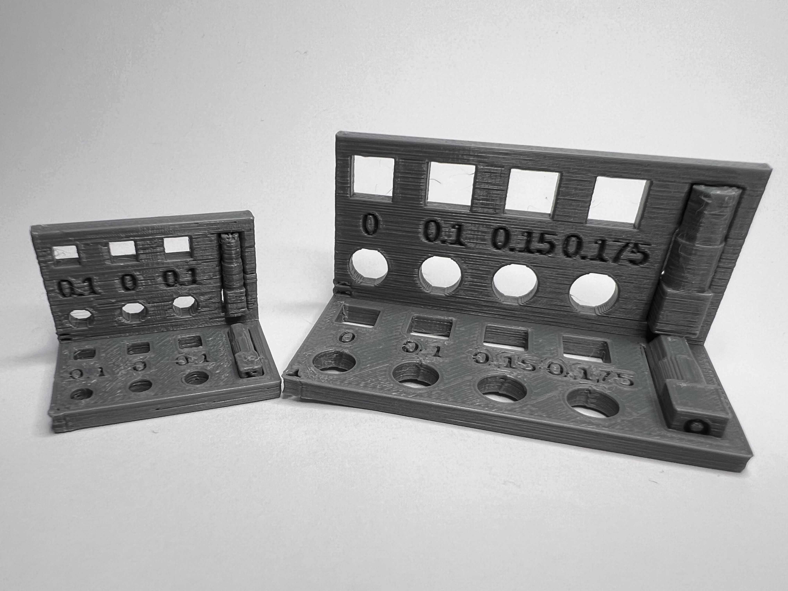
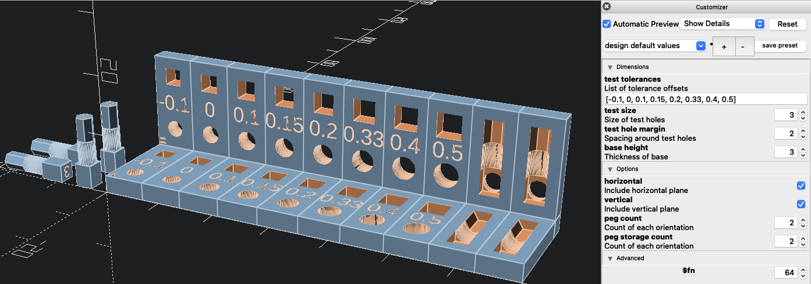

# Tolerance Test Parameterized

 

Hosted on [Printables](https://www.printables.com/model/779616-tolerance-test-parameterized). Recreated [Tolerance Test by jczuba](https://www.printables.com/model/740643-tolerance-test) in OpenSCAD.

Desired tolerances differ depending on the print orientation of the pieces you are fitting together. This tolerance test lets you test out tolerances for a variety of combinations of holes/pegs printed with axes parallel and perpendicular to the print bed.

The body of the tester has circular and square variable size holes printed with the center axis perpendicular and parallel to the print bed with customizable tolerances. 

The pegs have square section, circular section (middle), and octagonal section printed perpendicular and parallel to the print bed. Both the circular and octagonal sections are meant to be tested in the circular opening. Depending on the necessary print orientation, printing an octagonal section rather than a circular section might be a better option. This lets you test both options.

The base size of the tester is inscribed on the bottom/back of the body and pegs. The body of the tester and the pegs are inscribed with the orientation those axes were printed at to help remember their printing orientation. The body of the tester also includes slots to store the pegs between uses.

Print in whatever settings and filament you are planning for your main print that you want to test tolerances.

